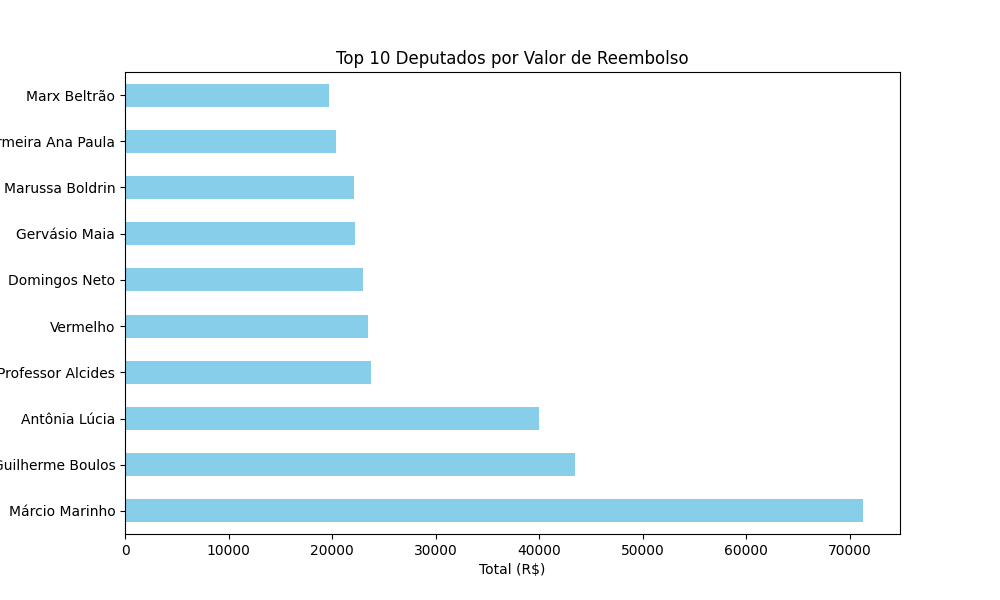
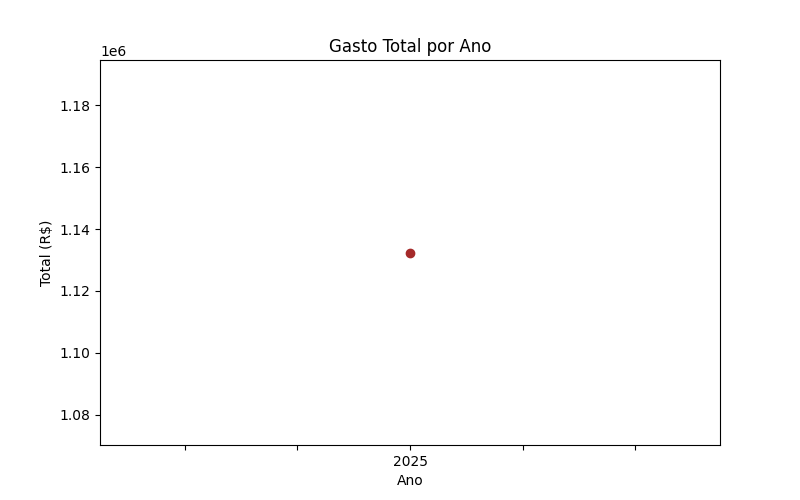

# 📊 Relatório de Reembolsos dos Deputados Federais

Este projeto realiza o **web scraping**, análise e visualização de dados públicos de **reembolsos parlamentares** disponibilizados pelo portal [Jarbas](https://jarbas.serenata.ai/dashboard/chamber_of_deputies/reimbursement/), com foco em transparência e fiscalização dos gastos da Câmara dos Deputados do Brasil.

---

## 🧰 Estrutura do Projeto

```
📁 deputados/
├── 📂 img/                        # Gráficos gerados automaticamente
│   ├── gasto_por_ano.png
│   ├── gasto_subquota.png
│   ├── media_reembolso.png
│   ├── quantidade_deputados.png
│   ├── suspeitos.png
│   ├── top_deputados.png
│   └── top_fornecedores.png
├── graficos.py                   # Script que gera os gráficos em PNG
├── index.py                      # Versão Python (Playwright) do scraper
├── index.R                       # Versão R (rvest) do scraper
├── juntar.py                     # Script que une os dados coletados
├── reembolso_total.json          # Dados consolidados em JSON
├── reembolso_1..10.json          # Arquivos JSON individuais por página
├── relatorio_reembolsos_completo.pdf # Relatório final em PDF
└── readme.md                     # Este arquivo
```

---

## ⚙️ Tecnologias Utilizadas

- `Python` (Playwright, Pandas, Matplotlib, FPDF)
- `R` (rvest, tidyverse)
- `JSON` e `CSV` para armazenamento de dados
- `LaTeX`/PDF para relatório final
- `Gráficos` exportados como `.png`

---

## 🔍 Funcionalidades

- Coleta automatizada dos dados de reembolso parlamentar
- Geração de base consolidada (JSON e CSV)
- Identificação de reembolsos suspeitos
- Análises visuais:
  - Gasto total por ano
  - Gasto por subcota
  - Média de reembolsos por deputado
  - Quantidade de deputados analisados
  - Top 10 deputados por gastos
  - Principais fornecedores
  - Incidência de casos suspeitos
- Exportação de relatório final em PDF

---

## 📈 Exemplos de Gráficos




---

## 📝 Relatório Final

O relatório em PDF `relatorio_reembolsos_completo.pdf` consolida todas as análises e gráficos com explicações detalhadas. Pode ser utilizado para **consultas públicas, apresentações acadêmicas ou matérias investigativas**.

---

## 🚀 Como Executar

1. Clone o repositório:
   ```bash
   git clone https://github.com/seuusuario/relatorio_reembolsos_completo.git
   cd relatorio_reembolsos_completo
   ```

2. Para rodar o scraper em **Python**:
   ```bash
   pip install -r requirements.txt
   python index.py
   ```

3. Para rodar o scraper em **R**:
   ```r
   source("index.R")
   ```

4. Para gerar os gráficos:
   ```bash
   python graficos.py
   ```

5. Relatório final será salvo como `relatorio_reembolsos_completo.pdf`

---

## 🤝 Contribuições

Sinta-se à vontade para abrir issues, dar sugestões ou enviar pull requests!

---

## 📄 Licença

Este projeto está sob a licença MIT. Sinta-se livre para usar e adaptar com os devidos créditos.
